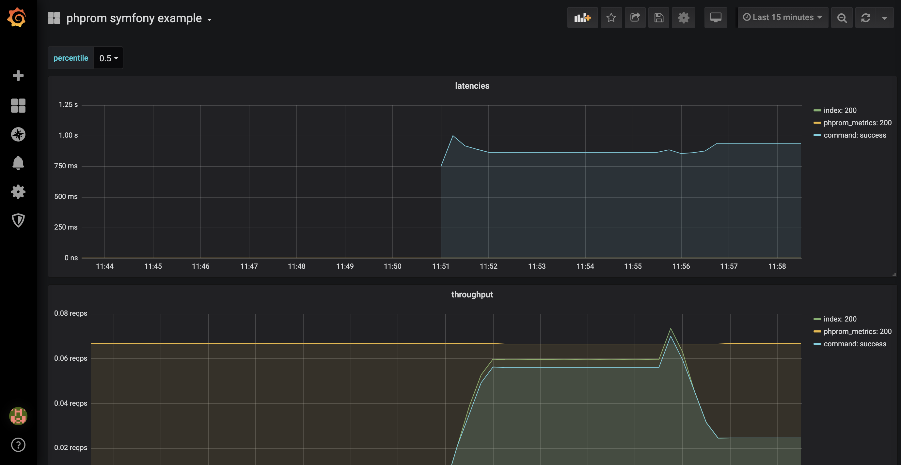

# example symfony app for phprom bundle
docker example for [phprom bundle](https://github.com/chaseisabelle/phprom-bundle)

---
### make

- `make start` to build, install, and run
- `make up` to build and run
- `make logs` to see the logs
- `make ps` alias for `docker-compose ps`
- `make install` to install composer dependencies
- `make upgrade` to upgrade composer dependencies
- `make curl` to hit the `GET /metrics` endpoint
- `make command` to run the symfony example command
- `make forever` run the command in a forever loop

---
### containers

- `symfony` the php [symfony app](https://symfony.com)
    - look in `/symfony` for the php app
- `phprom` the [phprom server](https://github.com/chaseisabelle/phprom)
- `prometheus` a [prometheus](https://prometheus.io/) instance
    - see `prometheus.yaml` for configs
    - navigate to `localhost:9090` for ui
- `grafana`
    
---    
### usage

1. run `make forever` to generate some traffic
1. navigate to `localhost:3000` for grafana ui
2. login with
    - username: admin
    - password: admin
3. select the dashboard

notes:
- use the "percentile" switcher in the top-left to select different latency percentiles
- the `make forever` runs the `forever.sh` script, it continuously runs the symfony command

---
### what to expect

---
todo

- automate the grafana setup process
