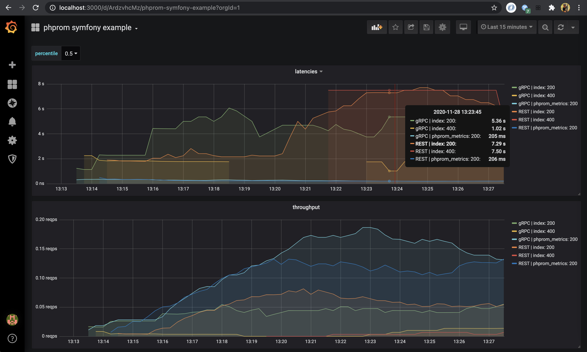
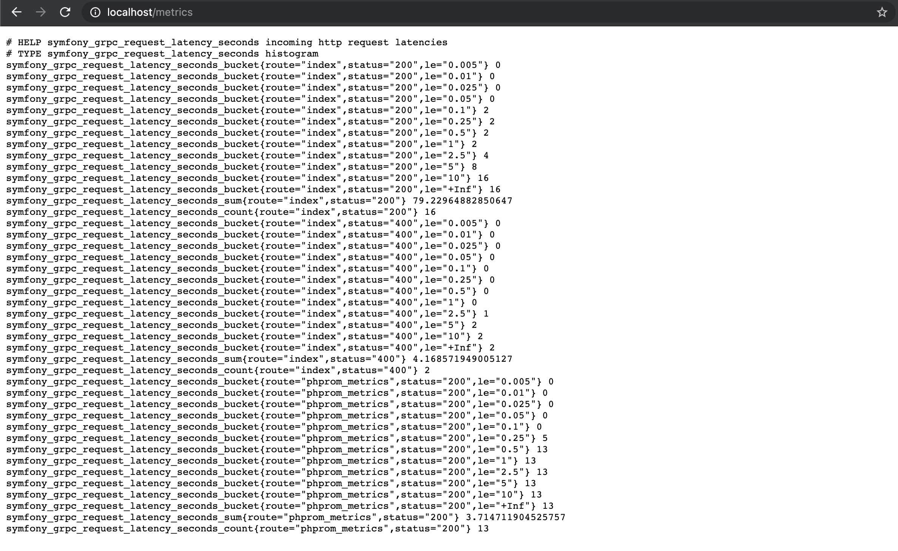
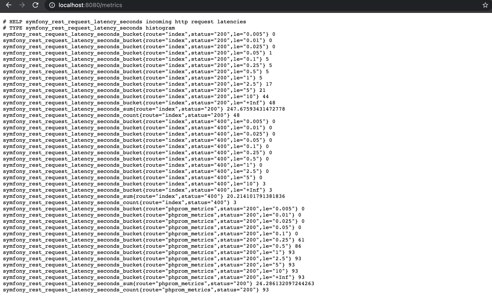

# example symfony app for phprom bundle
docker example for [phprom bundle](https://github.com/chaseisabelle/phprom-bundle)

---    
### usage

[](https://www.youtube.com/watch?v=XkTPMJzch8E)

1. `make restart` 
1. navigate to `localhost:3000`
2. login with
    - username: admin
    - password: admin
3. select "skip" or enter a custom password
4. select the dashboard

notes:
- use the "percentile" switcher in the top-left to select different latency percentiles

---
### what to expect

```
make ps
docker-compose ps
    Name                  Command               State           Ports
------------------------------------------------------------------------------
curler         docker-php-entrypoint php  ...   Up
grafana        /run.sh                          Up      0.0.0.0:3000->3000/tcp
phprom-grpc    /phprom                          Up      0.0.0.0:3333->3333/tcp
phprom-rest    /phprom --address=0.0.0.0: ...   Up      0.0.0.0:8888->8888/tcp
prometheus     /bin/prometheus --config.f ...   Up      0.0.0.0:9090->9090/tcp
symfony-grpc   docker-php-entrypoint php  ...   Up      0.0.0.0:80->80/tcp
symfony-rest   docker-php-entrypoint php  ...   Up      0.0.0.0:8080->8080/tcp
```







---
### commands

- `make restart` to do a clean start
- `make start` to build, install, and run
- `make up` to build and run
- `make logs` to see the logs
- `make ps` alias for `docker-compose ps`
- `make install` to install composer dependencies
- `make upgrade` to upgrade composer dependencies
- `make curl` to hit the `GET /metrics` endpoint
